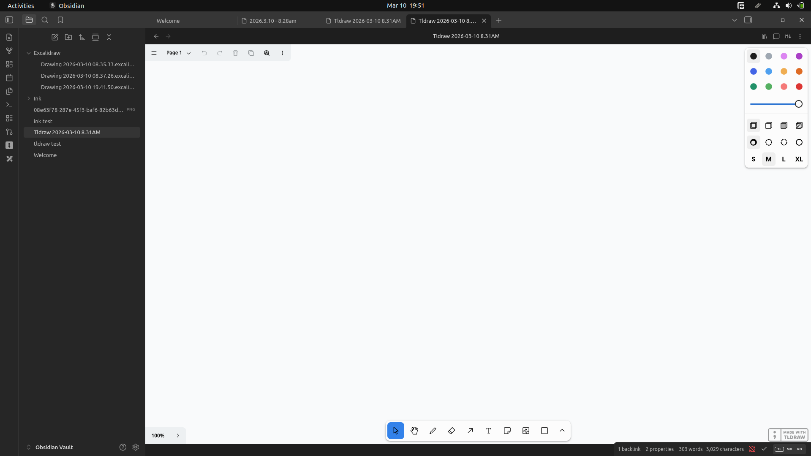

*the infinite canvas*


*options on the bottom right corner*


*an example drawing of "a b c" in the infinite canvas*

**markdown file generated by the official tl-draw plugin**
```json !!!_START_OF_TLDRAW_DATA__DO_NOT_CHANGE_THIS_PHRASE_!!!
{
	"meta": {
		"uuid": "142eae7e-493f-410c-aa4c-0d7891b84ae5",
		"plugin-version": "1.27.0",
		"tldraw-version": "3.15.3"
	},
	"raw": {
		"tldrawFileFormatVersion": 1,
		"schema": {
			"schemaVersion": 2,
			"sequences": {
				"com.tldraw.store": 4,
				"com.tldraw.asset": 1,
				"com.tldraw.camera": 1,
				"com.tldraw.document": 2,
				"com.tldraw.instance": 25,
				"com.tldraw.instance_page_state": 5,
				"com.tldraw.page": 1,
				"com.tldraw.instance_presence": 6,
				"com.tldraw.pointer": 1,
				"com.tldraw.shape": 4,
				"com.tldraw.asset.bookmark": 2,
				"com.tldraw.asset.image": 5,
				"com.tldraw.asset.video": 5,
				"com.tldraw.shape.arrow": 7,
				"com.tldraw.shape.bookmark": 2,
				"com.tldraw.shape.draw": 2,
				"com.tldraw.shape.embed": 4,
				"com.tldraw.shape.frame": 1,
				"com.tldraw.shape.geo": 10,
				"com.tldraw.shape.group": 0,
				"com.tldraw.shape.highlight": 1,
				"com.tldraw.shape.image": 5,
				"com.tldraw.shape.line": 5,
				"com.tldraw.shape.note": 9,
				"com.tldraw.shape.text": 3,
				"com.tldraw.shape.video": 4,
				"com.tldraw.binding.arrow": 1
			}
		},
		"records": [
			{
				"x": 802.2599792480469,
				"y": -572.45744435911,
				"rotation": 0,
				"isLocked": false,
				"opacity": 1,
				"meta": {},
				"id": "shape:iQzNB4HB6nUwBK4hMf0p1",
				"type": "draw",
				"props": {
					"segments": [
						{
							"type": "free",
							"points": [
								{
									"x": 0,
									"y": 0,
									"z": 0.5
								},
								{
									"x": -1.44,
									"y": -4.32,
									"z": 0.5
								},
								{
									"x": -2.88,
									"y": -4.32,
									"z": 0.5
								},
								{
									"x": -4.32,
									"y": -5.76,
									"z": 0.5
								},
								{
									"x": -7.2,
									"y": -8.64,
									"z": 0.5
								},
								{
									"x": -7.2,
									"y": -10.08,
									"z": 0.5
								},
								{
									"x": -8.64,
									"y": -11.52,
									"z": 0.5
								},
								{
									"x": -10.08,
									"y": -12.96,
									"z": 0.5
								},
								{
									"x": -11.52,
									"y": -14.4,
									"z": 0.5
								},
								{
									"x": -12.96,
									"y": -15.84,
									"z": 0.5
								},
								{
									"x": -15.84,
									"y": -17.28,
									"z": 0.5
								},
								{
									"x": -17.28,
									"y": -17.28,
									"z": 0.5
								},
								{
									"x": -18.72,
									"y": -17.28,
									"z": 0.5
								},
								{
									"x": -21.6,
									"y": -18.72,
									"z": 0.5
								},
								{
									"x": -23.04,
									"y": -18.72,
									"z": 0.5
								},
								{
									"x": -27.36,
									"y": -18.72,
									"z": 0.5
								},
								{
									"x": -28.8,
									"y": -18.72,
									"z": 0.5
								},
								{
									"x": -31.68,
									"y": -17.28,
									"z": 0.5
								},
								{
									"x": -33.12,
									"y": -17.28,
									"z": 0.5
								},
								{
									"x": -36,
									"y": -15.84,
									"z": 0.5
								},
								{
									"x": -37.44,
									"y": -15.84,
									"z": 0.5
								},
								{
									"x": -38.88,
									"y": -12.96,
									"z": 0.5
								},
								{
									"x": -41.76,
									"y": -10.08,
									"z": 0.5
								},
								{
									"x": -43.2,
									"y": -7.2,
									"z": 0.5
								},
								{
									"x": -44.64,
									"y": -4.32,
									"z": 0.5
								},
								{
									"x": -46.08,
									"y": -2.88,
									"z": 0.5
								},
								{
									"x": -47.52,
									"y": 0,
									"z": 0.5
								},
								{
									"x": -47.52,
									"y": 2.88,
									"z": 0.5
								},
								{
									"x": -48.96,
									"y": 4.32,
									"z": 0.5
								},
								{
									"x": -48.96,
									"y": 5.76,
									"z": 0.5
								},
								{
									"x": -48.96,
									"y": 8.64,
									"z": 0.5
								},
								{
									"x": -48.96,
									"y": 10.08,
									"z": 0.5
								},
								{
									"x": -48.96,
									"y": 12.96,
									"z": 0.5
								},
								{
									"x": -48.96,
									"y": 14.4,
									"z": 0.5
								},
								{
									"x": -48.96,
									"y": 15.84,
									"z": 0.5
								},
								{
									"x": -48.96,
									"y": 17.28,
									"z": 0.5
								},
								{
									"x": -48.96,
									"y": 20.16,
									"z": 0.5
								},
								{
									"x": -47.52,
									"y": 21.6,
									"z": 0.5
								},
								{
									"x": -46.08,
									"y": 23.04,
									"z": 0.5
								},
								{
									"x": -43.2,
									"y": 25.92,
									"z": 0.5
								},
								{
									"x": -40.32,
									"y": 27.36,
									"z": 0.5
								},
								{
									"x": -37.44,
									"y": 28.8,
									"z": 0.5
								},
								{
									"x": -34.56,
									"y": 28.8,
									"z": 0.5
								},
								{
									"x": -31.68,
									"y": 28.8,
									"z": 0.5
								},
								{
									"x": -27.36,
									"y": 28.8,
									"z": 0.5
								},
								{
									"x": -24.48,
									"y": 28.8,
									"z": 0.5
								},
								{
									"x": -21.6,
									"y": 28.8,
									"z": 0.5
								},
								{
									"x": -18.72,
									"y": 28.8,
									"z": 0.5
								},
								{
									"x": -17.28,
									"y": 28.8,
									"z": 0.5
								},
								{
									"x": -14.4,
									"y": 27.36,
									"z": 0.5
								},
								{
									"x": -11.52,
									"y": 25.92,
									"z": 0.5
								},
								{
									"x": -10.08,
									"y": 25.92,
									"z": 0.5
								},
								{
									"x": -7.2,
									"y": 24.48,
									"z": 0.5
								},
								{
									"x": -5.76,
									"y": 21.6,
									"z": 0.5
								},
								{
									"x": -5.76,
									"y": 18.72,
									"z": 0.5
								},
								{
									"x": -4.32,
									"y": 15.84,
									"z": 0.5
								},
								{
									"x": -4.32,
									"y": 14.4,
									"z": 0.5
								},
								{
									"x": -4.32,
									"y": 11.52,
									"z": 0.5
								},
								{
									"x": -4.32,
									"y": 10.08,
									"z": 0.5
								},
								{
									"x": -4.32,
									"y": 7.2,
									"z": 0.5
								},
								{
									"x": -4.32,
									"y": 5.76,
									"z": 0.5
								},
								{
									"x": -4.32,
									"y": 4.32,
									"z": 0.5
								},
								{
									"x": -4.32,
									"y": 1.44,
									"z": 0.5
								},
								{
									"x": -4.32,
									"y": 0,
									"z": 0.5
								},
								{
									"x": -4.32,
									"y": -1.44,
									"z": 0.5
								},
								{
									"x": -4.32,
									"y": -2.88,
									"z": 0.5
								},
								{
									"x": -2.88,
									"y": -1.44,
									"z": 0.5
								},
								{
									"x": -1.44,
									"y": 0,
									"z": 0.5
								},
								{
									"x": -1.44,
									"y": 1.44,
									"z": 0.5
								},
								{
									"x": 1.44,
									"y": 2.88,
									"z": 0.5
								},
								{
									"x": 2.88,
									"y": 4.32,
									"z": 0.5
								},
								{
									"x": 5.76,
									"y": 7.2,
									"z": 0.5
								},
								{
									"x": 7.2,
									"y": 8.64,
									"z": 0.5
								},
								{
									"x": 8.64,
									"y": 10.08,
									"z": 0.5
								},
								{
									"x": 8.64,
									"y": 11.52,
									"z": 0.5
								},
								{
									"x": 10.08,
									"y": 12.96,
									"z": 0.5
								},
								{
									"x": 11.52,
									"y": 12.96,
									"z": 0.5
								},
								{
									"x": 12.96,
									"y": 12.96,
									"z": 0.5
								},
								{
									"x": 14.4,
									"y": 12.96,
									"z": 0.5
								},
								{
									"x": 15.84,
									"y": 12.96,
									"z": 0.5
								},
								{
									"x": 17.28,
									"y": 12.96,
									"z": 0.5
								},
								{
									"x": 20.16,
									"y": 12.96,
									"z": 0.5
								},
								{
									"x": 23.04,
									"y": 12.96,
									"z": 0.5
								},
								{
									"x": 25.92,
									"y": 12.96,
									"z": 0.5
								},
								{
									"x": 27.36,
									"y": 12.96,
									"z": 0.5
								}
							]
						}
					],
					"color": "black",
					"fill": "none",
					"dash": "draw",
					"size": "m",
					"isComplete": true,
					"isClosed": false,
					"isPen": false,
					"scale": 1
				},
				"parentId": "page:page",
				"index": "a1",
				"typeName": "shape"
			},
			{
				"x": 0,
				"y": 0,
				"lastActivityTimestamp": 0,
				"meta": {},
				"id": "pointer:pointer",
				"typeName": "pointer"
			},
			{
				"x": 0,
				"y": 0,
				"z": 1,
				"meta": {},
				"id": "camera:page:page",
				"typeName": "camera"
			},
			{
				"x": 1170.8999938964844,
				"y": -625.7374126208288,
				"rotation": 0,
				"isLocked": false,
				"opacity": 1,
				"meta": {},
				"id": "shape:q6IgmlC3Z7JnfaGPiUXlv",
				"type": "draw",
				"props": {
					"segments": [
						{
							"type": "free",
							"points": [
								{
									"x": 0,
									"y": 0,
									"z": 0.5
								},
								{
									"x": -2.88,
									"y": -1.44,
									"z": 0.5
								},
								{
									"x": -8.64,
									"y": -2.88,
									"z": 0.5
								},
								{
									"x": -11.52,
									"y": -2.88,
									"z": 0.5
								},
								{
									"x": -15.84,
									"y": -2.88,
									"z": 0.5
								},
								{
									"x": -18.72,
									"y": -2.88,
									"z": 0.5
								},
								{
									"x": -28.8,
									"y": -2.88,
									"z": 0.5
								},
								{
									"x": -38.88,
									"y": 0,
									"z": 0.5
								},
								{
									"x": -41.76,
									"y": 1.44,
									"z": 0.5
								},
								{
									"x": -47.52,
									"y": 4.32,
									"z": 0.5
								},
								{
									"x": -50.4,
									"y": 5.76,
									"z": 0.5
								},
								{
									"x": -54.72,
									"y": 7.2,
									"z": 0.5
								},
								{
									"x": -57.6,
									"y": 8.64,
									"z": 0.5
								},
								{
									"x": -60.48,
									"y": 10.08,
									"z": 0.5
								},
								{
									"x": -61.92,
									"y": 11.52,
									"z": 0.5
								},
								{
									"x": -63.36,
									"y": 11.52,
									"z": 0.5
								},
								{
									"x": -67.68,
									"y": 14.4,
									"z": 0.5
								},
								{
									"x": -69.12,
									"y": 15.84,
									"z": 0.5
								},
								{
									"x": -70.56,
									"y": 15.84,
									"z": 0.5
								},
								{
									"x": -72,
									"y": 18.72,
									"z": 0.5
								},
								{
									"x": -72,
									"y": 21.6,
									"z": 0.5
								},
								{
									"x": -73.44,
									"y": 23.04,
									"z": 0.5
								},
								{
									"x": -73.44,
									"y": 25.92,
									"z": 0.5
								},
								{
									"x": -74.88,
									"y": 25.92,
									"z": 0.5
								},
								{
									"x": -74.88,
									"y": 28.8,
									"z": 0.5
								},
								{
									"x": -74.88,
									"y": 30.24,
									"z": 0.5
								},
								{
									"x": -74.88,
									"y": 33.12,
									"z": 0.5
								},
								{
									"x": -74.88,
									"y": 34.56,
									"z": 0.5
								},
								{
									"x": -74.88,
									"y": 37.44,
									"z": 0.5
								},
								{
									"x": -74.88,
									"y": 38.88,
									"z": 0.5
								},
								{
									"x": -73.44,
									"y": 40.32,
									"z": 0.5
								},
								{
									"x": -72,
									"y": 41.76,
									"z": 0.5
								},
								{
									"x": -70.56,
									"y": 44.64,
									"z": 0.5
								},
								{
									"x": -67.68,
									"y": 47.52,
									"z": 0.5
								},
								{
									"x": -64.8,
									"y": 47.52,
									"z": 0.5
								},
								{
									"x": -60.48,
									"y": 47.52,
									"z": 0.5
								},
								{
									"x": -59.04,
									"y": 47.52,
									"z": 0.5
								},
								{
									"x": -56.16,
									"y": 48.96,
									"z": 0.5
								},
								{
									"x": -53.28,
									"y": 48.96,
									"z": 0.5
								},
								{
									"x": -50.4,
									"y": 48.96,
									"z": 0.5
								},
								{
									"x": -47.52,
									"y": 48.96,
									"z": 0.5
								},
								{
									"x": -46.08,
									"y": 48.96,
									"z": 0.5
								},
								{
									"x": -43.2,
									"y": 48.96,
									"z": 0.5
								},
								{
									"x": -40.32,
									"y": 48.96,
									"z": 0.5
								},
								{
									"x": -38.88,
									"y": 48.96,
									"z": 0.5
								},
								{
									"x": -37.44,
									"y": 48.96,
									"z": 0.5
								},
								{
									"x": -34.56,
									"y": 48.96,
									"z": 0.5
								},
								{
									"x": -31.68,
									"y": 47.52,
									"z": 0.5
								},
								{
									"x": -30.24,
									"y": 47.52,
									"z": 0.5
								},
								{
									"x": -27.36,
									"y": 47.52,
									"z": 0.5
								},
								{
									"x": -24.48,
									"y": 46.08,
									"z": 0.5
								},
								{
									"x": -21.6,
									"y": 44.64,
									"z": 0.5
								},
								{
									"x": -18.72,
									"y": 43.2,
									"z": 0.5
								},
								{
									"x": -17.28,
									"y": 41.76,
									"z": 0.5
								},
								{
									"x": -14.4,
									"y": 40.32,
									"z": 0.5
								},
								{
									"x": -12.96,
									"y": 38.88,
									"z": 0.5
								},
								{
									"x": -11.52,
									"y": 37.44,
									"z": 0.5
								},
								{
									"x": -10.08,
									"y": 37.44,
									"z": 0.5
								},
								{
									"x": -8.64,
									"y": 37.44,
									"z": 0.5
								}
							]
						}
					],
					"color": "black",
					"fill": "none",
					"dash": "draw",
					"size": "m",
					"isComplete": true,
					"isClosed": false,
					"isPen": false,
					"scale": 1
				},
				"parentId": "page:page",
				"index": "a37xB",
				"typeName": "shape"
			},
			{
				"x": 953.4600524902344,
				"y": -625.7374126208288,
				"rotation": 0,
				"isLocked": false,
				"opacity": 1,
				"meta": {},
				"id": "shape:94zqqtdzWw3reavN9eSXr",
				"type": "draw",
				"props": {
					"segments": [
						{
							"type": "free",
							"points": [
								{
									"x": 0,
									"y": 0,
									"z": 0.5
								},
								{
									"x": -1.44,
									"y": 7.2,
									"z": 0.5
								},
								{
									"x": -1.44,
									"y": 12.96,
									"z": 0.5
								},
								{
									"x": -1.44,
									"y": 17.28,
									"z": 0.5
								},
								{
									"x": -1.44,
									"y": 23.04,
									"z": 0.5
								},
								{
									"x": -2.88,
									"y": 27.36,
									"z": 0.5
								},
								{
									"x": -2.88,
									"y": 33.12,
									"z": 0.5
								},
								{
									"x": -2.88,
									"y": 37.44,
									"z": 0.5
								},
								{
									"x": -2.88,
									"y": 40.32,
									"z": 0.5
								},
								{
									"x": -4.32,
									"y": 44.64,
									"z": 0.5
								},
								{
									"x": -4.32,
									"y": 47.52,
									"z": 0.5
								},
								{
									"x": -5.76,
									"y": 48.96,
									"z": 0.5
								},
								{
									"x": -5.76,
									"y": 51.84,
									"z": 0.5
								},
								{
									"x": -5.76,
									"y": 53.28,
									"z": 0.5
								},
								{
									"x": -5.76,
									"y": 54.72,
									"z": 0.5
								},
								{
									"x": -5.76,
									"y": 56.16,
									"z": 0.5
								},
								{
									"x": -5.76,
									"y": 54.72,
									"z": 0.5
								},
								{
									"x": -5.76,
									"y": 51.84,
									"z": 0.5
								},
								{
									"x": -4.32,
									"y": 50.4,
									"z": 0.5
								},
								{
									"x": -2.88,
									"y": 46.08,
									"z": 0.5
								},
								{
									"x": -1.44,
									"y": 43.2,
									"z": 0.5
								},
								{
									"x": 0,
									"y": 41.76,
									"z": 0.5
								},
								{
									"x": 1.44,
									"y": 38.88,
									"z": 0.5
								},
								{
									"x": 1.44,
									"y": 36,
									"z": 0.5
								},
								{
									"x": 4.32,
									"y": 34.56,
									"z": 0.5
								},
								{
									"x": 5.76,
									"y": 31.68,
									"z": 0.5
								},
								{
									"x": 8.64,
									"y": 30.24,
									"z": 0.5
								},
								{
									"x": 11.52,
									"y": 27.36,
									"z": 0.5
								},
								{
									"x": 12.96,
									"y": 25.92,
									"z": 0.5
								},
								{
									"x": 15.84,
									"y": 24.48,
									"z": 0.5
								},
								{
									"x": 18.72,
									"y": 24.48,
									"z": 0.5
								},
								{
									"x": 21.6,
									"y": 23.04,
									"z": 0.5
								},
								{
									"x": 23.04,
									"y": 23.04,
									"z": 0.5
								},
								{
									"x": 25.92,
									"y": 21.6,
									"z": 0.5
								},
								{
									"x": 27.36,
									"y": 21.6,
									"z": 0.5
								},
								{
									"x": 30.24,
									"y": 21.6,
									"z": 0.5
								},
								{
									"x": 33.12,
									"y": 21.6,
									"z": 0.5
								},
								{
									"x": 34.56,
									"y": 21.6,
									"z": 0.5
								},
								{
									"x": 36,
									"y": 21.6,
									"z": 0.5
								},
								{
									"x": 37.44,
									"y": 23.04,
									"z": 0.5
								},
								{
									"x": 40.32,
									"y": 24.48,
									"z": 0.5
								},
								{
									"x": 41.76,
									"y": 25.92,
									"z": 0.5
								},
								{
									"x": 43.2,
									"y": 27.36,
									"z": 0.5
								},
								{
									"x": 44.64,
									"y": 28.8,
									"z": 0.5
								},
								{
									"x": 44.64,
									"y": 30.24,
									"z": 0.5
								},
								{
									"x": 47.52,
									"y": 31.68,
									"z": 0.5
								},
								{
									"x": 48.96,
									"y": 33.12,
									"z": 0.5
								},
								{
									"x": 48.96,
									"y": 36,
									"z": 0.5
								},
								{
									"x": 48.96,
									"y": 38.88,
									"z": 0.5
								},
								{
									"x": 48.96,
									"y": 41.76,
									"z": 0.5
								},
								{
									"x": 48.96,
									"y": 43.2,
									"z": 0.5
								},
								{
									"x": 48.96,
									"y": 46.08,
									"z": 0.5
								},
								{
									"x": 47.52,
									"y": 48.96,
									"z": 0.5
								},
								{
									"x": 46.08,
									"y": 51.84,
									"z": 0.5
								},
								{
									"x": 44.64,
									"y": 53.28,
									"z": 0.5
								},
								{
									"x": 44.64,
									"y": 54.72,
									"z": 0.5
								},
								{
									"x": 43.2,
									"y": 56.16,
									"z": 0.5
								},
								{
									"x": 41.76,
									"y": 57.6,
									"z": 0.5
								},
								{
									"x": 38.88,
									"y": 59.04,
									"z": 0.5
								},
								{
									"x": 37.44,
									"y": 60.48,
									"z": 0.5
								},
								{
									"x": 34.56,
									"y": 60.48,
									"z": 0.5
								},
								{
									"x": 33.12,
									"y": 60.48,
									"z": 0.5
								},
								{
									"x": 30.24,
									"y": 60.48,
									"z": 0.5
								},
								{
									"x": 28.8,
									"y": 60.48,
									"z": 0.5
								},
								{
									"x": 24.48,
									"y": 60.48,
									"z": 0.5
								},
								{
									"x": 23.04,
									"y": 60.48,
									"z": 0.5
								},
								{
									"x": 20.16,
									"y": 60.48,
									"z": 0.5
								},
								{
									"x": 18.72,
									"y": 60.48,
									"z": 0.5
								},
								{
									"x": 17.28,
									"y": 60.48,
									"z": 0.5
								},
								{
									"x": 15.84,
									"y": 60.48,
									"z": 0.5
								},
								{
									"x": 14.4,
									"y": 60.48,
									"z": 0.5
								},
								{
									"x": 12.96,
									"y": 60.48,
									"z": 0.5
								},
								{
									"x": 12.96,
									"y": 59.04,
									"z": 0.5
								},
								{
									"x": 12.96,
									"y": 56.16,
									"z": 0.5
								},
								{
									"x": 12.96,
									"y": 53.28,
									"z": 0.5
								},
								{
									"x": 10.08,
									"y": 51.84,
									"z": 0.5
								},
								{
									"x": 10.08,
									"y": 50.4,
									"z": 0.5
								},
								{
									"x": 8.64,
									"y": 47.52,
									"z": 0.5
								},
								{
									"x": 5.76,
									"y": 46.08,
									"z": 0.5
								},
								{
									"x": 1.44,
									"y": 44.64,
									"z": 0.5
								},
								{
									"x": 1.44,
									"y": 43.2,
									"z": 0.5
								}
							]
						}
					],
					"color": "black",
					"fill": "none",
					"dash": "draw",
					"size": "m",
					"isComplete": true,
					"isClosed": false,
					"isPen": false,
					"scale": 1
				},
				"parentId": "page:page",
				"index": "a29g2",
				"typeName": "shape"
			},
			{
				"editingShapeId": null,
				"croppingShapeId": null,
				"selectedShapeIds": [],
				"hoveredShapeId": null,
				"erasingShapeIds": [],
				"hintingShapeIds": [],
				"focusedGroupId": null,
				"meta": {},
				"id": "instance_page_state:page:page",
				"pageId": "page:page",
				"typeName": "instance_page_state"
			},
			{
				"x": 1582.7400817871094,
				"y": -110.21745412473501,
				"rotation": 0,
				"isLocked": false,
				"opacity": 1,
				"meta": {},
				"id": "shape:DiGt-NxjkyRkLxzf2Ogh4",
				"type": "draw",
				"props": {
					"segments": [
						{
							"type": "free",
							"points": [
								{
									"x": 0,
									"y": 0,
									"z": 0.5
								}
							]
						}
					],
					"color": "black",
					"fill": "none",
					"dash": "draw",
					"size": "m",
					"isComplete": true,
					"isClosed": false,
					"isPen": false,
					"scale": 1
				},
				"parentId": "page:page",
				"index": "a4BF0",
				"typeName": "shape"
			},
			{
				"meta": {},
				"id": "page:page",
				"name": "Page 1",
				"index": "a1",
				"typeName": "page"
			},
			{
				"gridSize": 10,
				"name": "",
				"meta": {},
				"id": "document:document",
				"typeName": "document"
			},
			{
				"followingUserId": null,
				"opacityForNextShape": 1,
				"stylesForNextShape": {},
				"brush": null,
				"scribbles": [],
				"cursor": {
					"type": "default",
					"rotation": 0
				},
				"isFocusMode": false,
				"exportBackground": true,
				"isDebugMode": false,
				"isToolLocked": false,
				"screenBounds": {
					"x": 0,
					"y": 0,
					"w": 1080,
					"h": 720
				},
				"insets": [
					false,
					false,
					false,
					false
				],
				"zoomBrush": null,
				"isGridMode": false,
				"isPenMode": false,
				"chatMessage": "",
				"isChatting": false,
				"highlightedUserIds": [],
				"isFocused": false,
				"devicePixelRatio": 1,
				"isCoarsePointer": false,
				"isHoveringCanvas": null,
				"openMenus": [],
				"isChangingStyle": false,
				"isReadonly": false,
				"meta": {},
				"duplicateProps": null,
				"id": "instance:instance",
				"currentPageId": "page:page",
				"typeName": "instance"
			}
		]
	}
}
!!!_END_OF_TLDRAW_DATA__DO_NOT_CHANGE_THIS_PHRASE_!!!
```